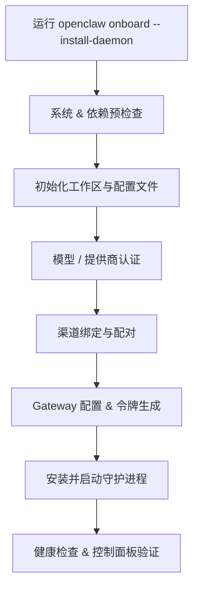
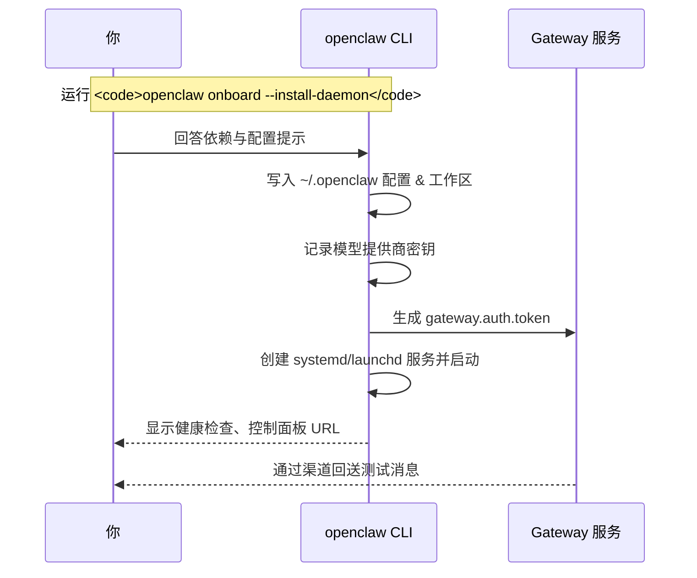

# OpenClaw `onboard --install-daemon` 向导步骤解析

> 适用范围：在 macOS、Linux、云主机等环境中运行 `openclaw onboard --install-daemon` 之后，终端里呈现的交互式初始化向导。以下说明逐步拆解每个阶段的目的、背后动作，以及需要注意的安全要点。

## 一图总览



## 步骤 1：系统与依赖预检查
- **做了什么**：向导首先检测 Node 版本、`openclaw` CLI 自身版本、必要的系统权限（如 macOS TCC）、以及是否存在旧配置。遇到损坏或冲突配置会提示重置。
- **目的**：确保环境满足最低要求，避免在后续阶段因依赖缺失而失败。
- **注意**：如果之前运行过 OpenClaw，这里会提供“继续使用现有配置 / 重置后重来”的选项。

## 步骤 2：工作区与配置脚手架
- **做了什么**：在 `~/.openclaw/` 下创建配置（`openclaw.json`、认证存储、channels 目录等）与默认工作区（`~/.openclaw/workspace`，包含 `AGENTS.md`、`SOUL.md` 模板等）。
- **目的**：把运行态与项目文件分离，便于备份与迁移；同时生成多份配置备份（`.bak`）。
- **注意**：此阶段还会写入 `agents.defaults`、`channels.*` 等基础字段，供后续步骤覆盖。

## 步骤 3：模型与提供商认证
- **做了什么**：向导列出可用模型提供商（OpenAI、Anthropic、OpenRouter、QClaw、自建 Ollama 等），并提示输入 API Key 或 OAuth token；也会尝试读取现有环境变量（如 `OPENAI_API_KEY`）。
- **目的**：为默认智能体配置“主模型”（`agents.defaults.model.primary`），并在 `auth-profiles.json` 中保存凭证，以便 Gateway 调用时可以自动轮询。
- **注意**：
  - 输入的密钥会写入本地认证存储，向导会显示脱敏预览供确认。
  - 可以一次配置多个提供商，稍后通过 `/model` 切换。

## 步骤 4：渠道绑定与配对
- **做了什么**：根据需要选择 Telegram、WhatsApp、Discord、Webchat、Signal 等渠道。向导会：
  1. 在配置文件里启用对应渠道节点（如 `channels.telegram.enabled`）。
  2. 生成或提示粘贴配对码，例如 WhatsApp 的二维码登录、Telegram 的 `pairing approve`。
- **目的**：让 Gateway 知道从哪些渠道接收/发送消息，同时记录配对策略（默认 DM allow，群聊 allowlist 等）。
- **注意**：
  - 有些渠道（如 WhatsApp）需要实时扫码，向导会暂停等待用户完成。
  - Telegram/WhatsApp 默认启用“配对审批”模式，防止陌生人滥用；需要的话可自定义策略。

## 步骤 5：Gateway 配置与令牌生成
- **做了什么**：
  - 生成 Gateway 控制面的访问令牌（`gateway.auth.token`），并写入配置。
  - 询问运行模式：`local`（仅 loopback）、`remote`（可绑定外网 IP / Tailscale / SSH 隧道）以及端口（默认 18789）。
  - 配置控制台可选的 Tailscale/TLS/反向代理设置。
- **目的**：确保 Web 控制台、API、Webchat 都有受控入口，并且只有持有令牌或满足身份校验的实体才能访问。
- **注意**：
  - 如果计划暴露在公网，建议在这里选择 `gateway.auth.mode=password/token` 并限制 `bind`；默认的 `loopback` 最安全。
  - 日后可通过 `openclaw config set gateway.*` 调整。

## 步骤 6：安装守护进程
- **做了什么**：
  - 根据平台创建 systemd（Linux）、launchd（macOS）、或 Windows 服务。
  - 写入服务文件，使 Gateway 在开机或登录后自动启动。
  - 立即启动一次服务，并跟踪日志验证无错误。
- **目的**：让 Gateway 常驻运行，保证渠道事件与心跳调度不会因为终端关闭而中断。
- **注意**：
  - systemd 路径通常是 `~/.config/systemd/user/openclaw-gateway.service`；macOS 使用 `~/Library/LaunchAgents/ai.openclaw.gateway.plist`。
  - 变更配置后可通过 `openclaw gateway restart` 或 `systemctl --user restart openclaw-gateway` 热重启。

## 步骤 7：健康检查与控制面板验证
- **做了什么**：
  - 自动调用 `openclaw status`/`openclaw health` 检查 Gateway、模型认证、渠道连接；
  - 提示访问 `http://localhost:18789`（或远程地址）打开 Control UI，确认 Webchat、日志、配置页都可用；
  - 给出测试命令，如 `openclaw message send --target <您自己> --message "Hello"`。
- **目的**：在离开向导前，确保事件循环、队列、模型推理都已打通，避免上线后才发现缺少权限或 API Key 失效。
- **注意**：如果健康检查失败，向导会给出“重试 / 打开日志 / 退出后手动修复”的选项。

## 参考流程时序图



## 文件位置与后续修改
- 主配置：`~/.openclaw/openclaw.json`
- 认证配置文件：`~/.openclaw/agents/<agentId>/auth-profiles.json`
- 工作区：`~/.openclaw/workspace/`
- 守护进程文件：
  - Linux：`~/.config/systemd/user/openclaw-gateway.service`
  - macOS：`~/Library/LaunchAgents/ai.openclaw.gateway.plist`

日后如需重新运行向导，可执行：
```bash
openclaw reset --scope onboarding
openclaw onboard --install-daemon
```
或直接编辑 `openclaw.json` 并重启 Gateway 使配置生效。
